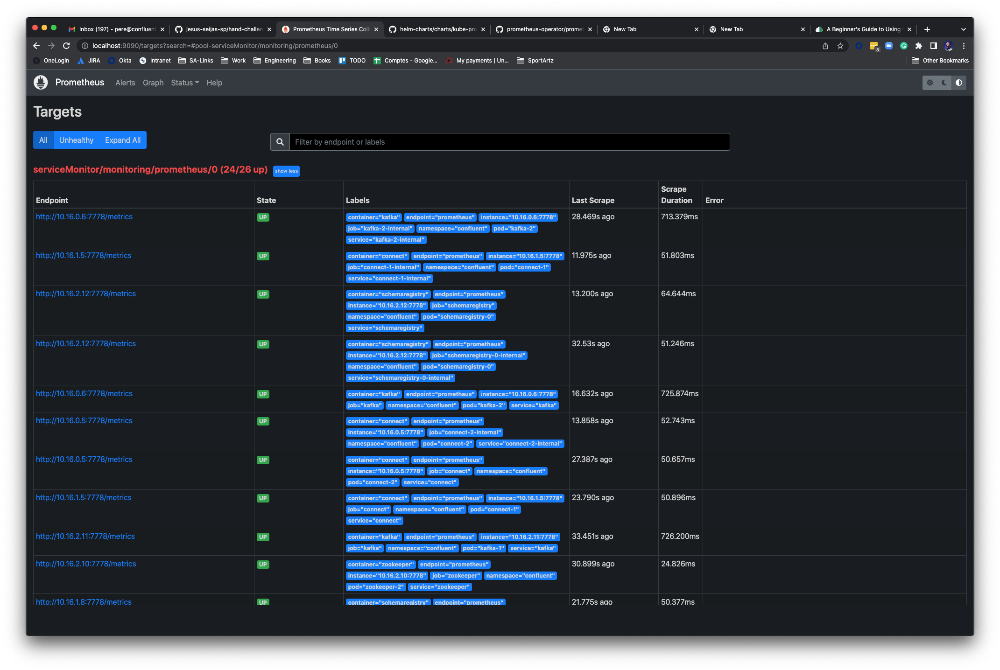
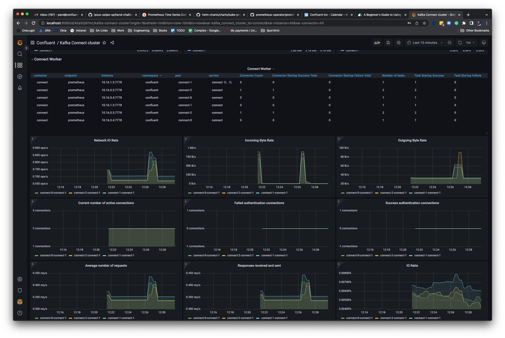

# Monitoring example

Simple monitoring stack with Prometheus and Grafana for monitoring a Kubernetes and/or Confluent Cloud deployment.

## Deploy Confluent for Kubernetes

Create the confluent namespace:

```bash
$ kubectl create namespace confluent                                                                                     2.7.0

namespace/confluent created
```

Install the CFK operator:

```bash
$ helm upgrade --install operator confluentinc/confluent-for-kubernetes  --namespace confluent                           2.7.0

Release "operator" does not exist. Installing it now.
NAME: operator
LAST DEPLOYED: Wed Jul 20 10:43:30 2022
NAMESPACE: confluent
STATUS: deployed
REVISION: 1
TEST SUITE: None
NOTES:
The Confluent Operator

The Confluent Operator brings the component (Confluent Services) specific controllers for kubernetes by providing components specific Custom Resource
Definition (CRD) as well as managing other Confluent Platform services
```

Deploy Confluent Platform using the operator:

```bash
$ kubectl apply -f confluent-platform.yaml                                                                               2.7.0

zookeeper.platform.confluent.io/zookeeper created
kafka.platform.confluent.io/kafka created
connect.platform.confluent.io/connect created
ksqldb.platform.confluent.io/ksqldb created
controlcenter.platform.confluent.io/controlcenter created
schemaregistry.platform.confluent.io/schemaregistry created
kafkarestproxy.platform.confluent.io/kafkarestproxy created
```

```bash
$ kubectl get pods                                                                                                       2.7.0
NAME                                  READY   STATUS    RESTARTS   AGE
confluent-operator-674d687649-4g89j   1/1     Running   0          9m38s
connect-0                             1/1     Running   0          9m10s
connect-1                             1/1     Running   0          9m10s
connect-2                             1/1     Running   0          9m9s
controlcenter-0                       1/1     Running   0          6m42s
kafka-0                               1/1     Running   0          7m41s
kafka-1                               1/1     Running   0          7m41s
kafka-2                               1/1     Running   0          7m40s
ksqldb-0                              1/1     Running   0          6m42s
schemaregistry-0                      1/1     Running   0          6m41s
schemaregistry-1                      1/1     Running   0          6m41s
zookeeper-0                           1/1     Running   0          9m12s
zookeeper-1                           1/1     Running   0          9m12s
zookeeper-2                           1/1     Running   0          9m12s
```


## Deploy Prometheus and Grafana

<!---
 helm upgrade --install azuredeploy stable/prometheus \
  --set alertmanager.persistentVolume.enabled=true \
  --set server.persistentVolume.enabled=true \
  --set-file extraScrapeConfigs=./prometheus/extraScrapeConfigs.yaml \
  --namespace monitoring
--->

Create the monitoring namespace:


```bash
$ kubectl create namespace monitoring                                                                                    2.7.0

namespace/monitoring created
```

Deploy the Prometheus Stack operator:

```bash
$ helm upgrade  --install confluentmon  prometheus-community/kube-prometheus-stack \                                     2.7.0
 --set alertmanager.persistentVolume.enabled=true \
 --set server.persistentVolume.enabled=true \
 --set grafana.sidecar.datasources.uid=promsys \
 --namespace monitoring
Release "confluentmon" does not exist. Installing it now.
NAME: confluentmon
LAST DEPLOYED: Wed Jul 20 10:58:11 2022
NAMESPACE: monitoring
STATUS: deployed
REVISION: 1
NOTES:
kube-prometheus-stack has been installed. Check its status by running:
  kubectl --namespace monitoring get pods -l "release=confluentmon"

Visit https://github.com/prometheus-operator/kube-prometheus for instructions on how to create & configure Alertmanager and Prometheus instances using the Operator.
```

Enable the right service account and rbac bindings for the prometheus scrappers to work:

```bash
$ kubectl apply -f prometheus/rbac.yaml                                                                                  2.7.0
serviceaccount/prometheus created
clusterrole.rbac.authorization.k8s.io/prometheus created
clusterrolebinding.rbac.authorization.k8s.io/prometheus created
```

Configure the Service Monitor and Prometheus instance to monitor the Confluent Platform deployment:

```bash
$ kubectl apply -f prometheus/service-monitor.yaml                                                                       2.7.0
servicemonitor.monitoring.coreos.com/prometheus created
```

```bash
$ kubectl apply -f prometheus/prometheus.yaml                                                                            2.7.0
prometheus.monitoring.coreos.com/prometheus created
```

```bash
$ kubectl get pods                                                                                                       2.7.0
NAME                                                     READY   STATUS    RESTARTS   AGE
alertmanager-confluentmon-kube-promethe-alertmanager-0   2/2     Running   0          9m32s
confluentmon-grafana-5c8d8f8c88-m2d2c                    3/3     Running   0          9m37s
confluentmon-kube-promethe-operator-67756bd876-nm74d     1/1     Running   0          9m37s
confluentmon-kube-state-metrics-5b47b568c9-w26hj         1/1     Running   0          9m37s
confluentmon-prometheus-node-exporter-fg7dh              1/1     Running   0          9m37s
confluentmon-prometheus-node-exporter-l8qs4              1/1     Running   0          9m37s
confluentmon-prometheus-node-exporter-s6jfd              1/1     Running   0          9m37s
prometheus-confluentmon-kube-promethe-prometheus-0       2/2     Running   0          9m32s
prometheus-prometheus-0                                  2/2     Running   0          24s
prometheus-prometheus-1                                  2/2     Running   0          24s
```

You can now access Prometheus and Grafana with the expected port-forward commands:

```bash
$ kubectl port-forward svc/prometheus-operated 9090:9090                                                                 2.7.0
Forwarding from 127.0.0.1:9090 -> 9090
Forwarding from [::1]:9090 -> 9090
```

```bash
$ kubectl port-forward svc/confluentmon-grafana 8080:80                                                                  2.7.0
Forwarding from 127.0.0.1:8080 -> 3000
Forwarding from [::1]:8080 -> 3000
```

How to get the Grafana admin password:

```bash
$ kubectl get secret --namespace monitoring confluentmon-grafana -o jsonpath="{.data.admin-password}" | base64 --decode ; echo
prom-operator
```

Note once into Grafana, you will need to deploy the data sources and dashboards, they are in the grafana folder in this repo.







You can create a connector to generate traffic in the deployment:

```bash
$ kubectl apply -f connector.yaml -n confluent                                                                           2.7.0
kafkatopic.platform.confluent.io/pageviews created
connector.platform.confluent.io/pageviews created
```

### References

https://blog.container-solutions.com/prometheus-operator-beginners-guide
